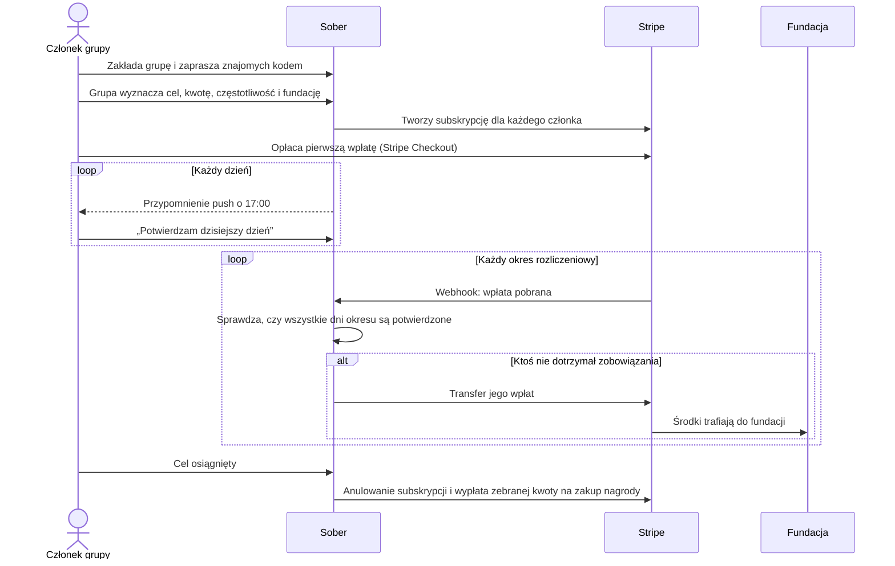
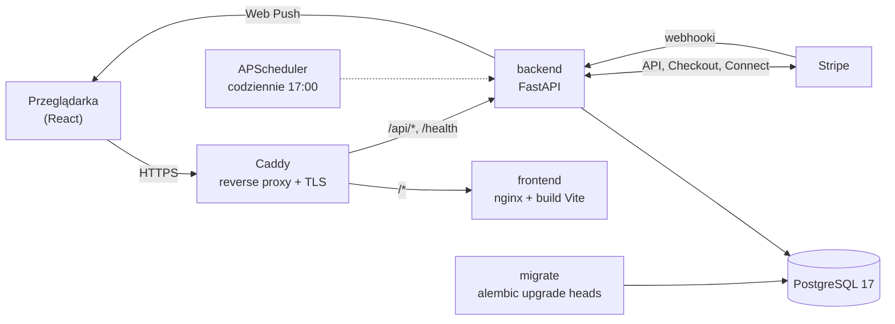
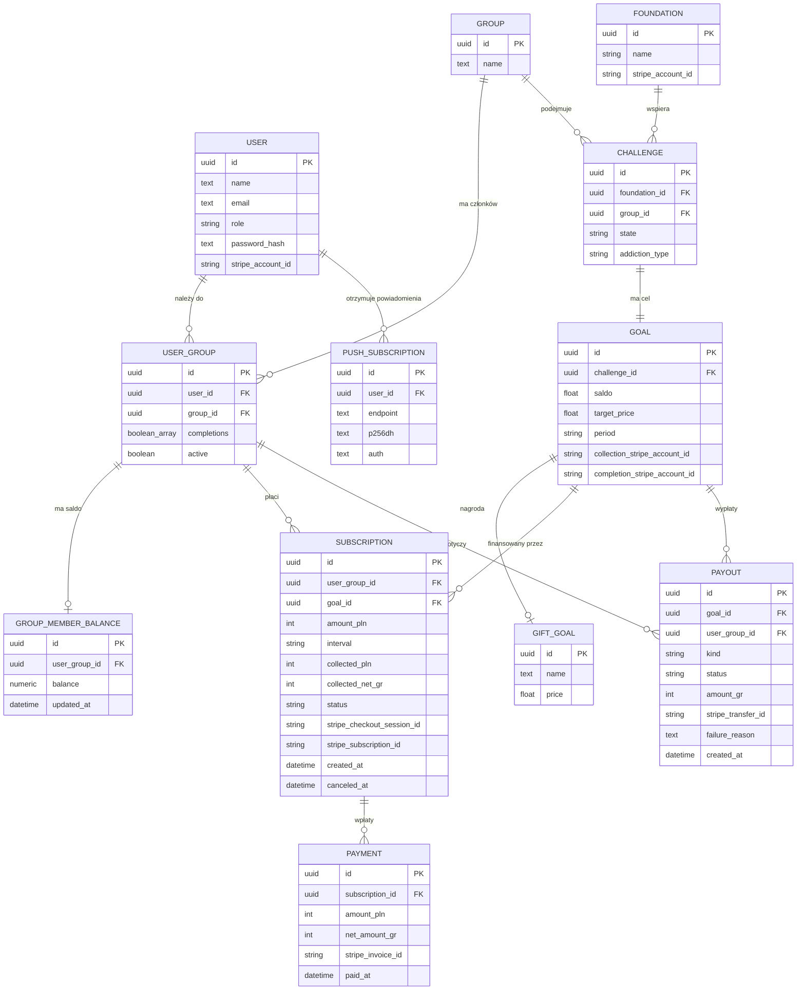

# StaySober

**Wspólne wyjście z nałogu, w którym pieniądze pracują na Twoją motywację.**

Sober to aplikacja dla małych grup znajomych, które razem walczą z nałogiem: papierosami, alkoholem, hazardem albo dowolnym innym nawykiem. Każdy członek grupy regularnie odkłada pieniądze na wspólny cel, np. wyjazd w góry albo bilety na koncert, i codziennie potwierdza, że dotrzymał zobowiązania. Kto się złamie, traci swoje wpłaty na rzecz fundacji wybranej przez grupę. Kto wytrwa, razem z resztą realizuje wspólne marzenie.

**Wersja demonstracyjna: [staysober.wsparcie.dev](https://staysober.wsparcie.dev/)**

---

## Spis treści

1. [Problem](#problem)
2. [Rozwiązanie i wartość dodana](#rozwiązanie-i-wartość-dodana)
3. [Jak to działa](#jak-to-działa)
4. [Funkcje](#funkcje)
5. [Stack technologiczny](#stack-technologiczny)
6. [Architektura](#architektura)
7. [Baza danych](#baza-danych)
8. [Struktura repozytorium](#struktura-repozytorium)
9. [Uruchomienie krok po kroku](#uruchomienie-krok-po-kroku)
10. [Konfiguracja `.env`](#konfiguracja-env)
11. [Stripe: płatności i wypłaty](#stripe-płatności-i-wypłaty)
12. [Tryb deweloperski bez Dockera](#tryb-deweloperski-bez-dockera)
13. [Testy i jakość](#testy-i-jakość)
14. [Wdrożenie na serwer (VPS)](#wdrożenie-na-serwer-vps)
15. [Przegląd API](#przegląd-api)
16. [Co dalej](#co-dalej)

---

## Problem

- Rzucanie nałogu w pojedynkę ma bardzo niską skuteczność. Brakuje wsparcia, a jedyną konsekwencją porażki jest wyrzut sumienia.
- Aplikacje do śledzenia nawyków liczą dni, ale nie dają ani wspólnoty, ani realnej stawki.
- Pieniądze zaoszczędzone na nałogu (paczka papierosów dziennie to ponad 1000 zł miesięcznie) rozpływają się w codziennych wydatkach i nie stają się nagrodą.

## Rozwiązanie i wartość dodana

Sober łączy trzy mechanizmy, które osobno znamy z psychologii zmiany nawyków, w jeden prosty produkt:

| Mechanizm                                  | Jak działa w Sober                                                                                                                  |
| ------------------------------------------ | ----------------------------------------------------------------------------------------------------------------------------------- |
| **Wspólnota**                              | Zobowiązanie podejmuje się w grupie znajomych. Każdy widzi, kto dziś potwierdził swój dzień.                                        |
| **Stawka (commitment device)**             | Regularna wpłata na wspólny cel. Złamanie zobowiązania oznacza utratę wpłat, a nie tylko „zerowanie licznika”.                      |
| **Nagroda z pozytywnym skutkiem ubocznym** | Wytrwałość kończy się wspólną nagrodą. Porażka nie wzbogaca nikogo z grupy, tylko trafia do fundacji pomagającej osobom w kryzysie. |

**Jaki to mam wpływ:**

- **Nikt nie zarabia na cudzej porażce.** Pieniądze osoby, która się złamała, trafiają do fundacji, a nie do pozostałych członków. Grupa nie ma interesu, żeby ktoś odpadł, więc wspiera zamiast rywalizować.
- **Prawdziwe pieniądze, prawdziwe płatności.** Wpłaty są pobierane automatycznie kartą przez Stripe (subskrypcje), a wypłaty realizowane przez Stripe Connect. Nie ma tu wirtualnych punktów.
- **Codzienny, lekki rytm.** Jedno kliknięcie dziennie („potwierdzam dzisiejszy dzień”) i przypomnienie push o 17:00.
- **Dostępność od pierwszego dnia.** Tryb ciemny, wysoki kontrast, większy tekst i ograniczenie animacji, zgodnie z WCAG.

## Jak to działa



1. **Grupa.** Użytkownik zakłada grupę i dzieli się jej kodem. Znajomi dołączają tym kodem.
2. **Cel.** Grupa wybiera, na co zbiera, z czym walczy (alkohol, nikotyna, hazard, inne), jak często płaci (codziennie, co tydzień, co miesiąc) i która fundacja dostanie środki w razie porażki.
3. **Wpłaty.** Dla każdego członka powstaje subskrypcja Stripe. Pierwszą płatność potwierdza się w Stripe Checkout, kolejne pobierają się automatycznie.
4. **Codzienne potwierdzenie.** Codziennie o 17:00 (czas warszawski) system otwiera nowy dzień do potwierdzenia i wysyła przypomnienie push.
5. **Rozliczenie okresu.** Przy każdej kolejnej wpłacie system sprawdza poprzedni okres. Jeśli ktoś nie potwierdził wszystkich dni, jego wpłaty automatycznie trafiają do fundacji.
6. **Nagroda.** Po osiągnięciu celu subskrypcje są anulowane, a zebrane środki wypłacane na zakup wspólnej nagrody.

## Funkcje

### Konto i bezpieczeństwo

- Rejestracja i logowanie z hasłami haszowanymi algorytmem PBKDF2-SHA256 (390 000 iteracji).
- Sesja oparta na tokenach JWT, chronione trasy w aplikacji i automatyczne wylogowanie po wygaśnięciu sesji.
- Role użytkownika i administratora. Operacje na wypłatach i fundacjach wymagają uprawnień.

### Grupy

- Tworzenie grupy, dołączanie kodem, zmiana nazwy, opuszczenie grupy.
- Wstrzymanie własnego udziału bez opuszczania grupy.
- Lista członków z informacją, kto potwierdził dzisiejszy dzień.

### Cel i wyzwanie

- Wspólny cel z kwotą docelową, typem nałogu, częstotliwością wpłat i fundacją.
- Postęp celu w czasie rzeczywistym (zebrana kwota, procent, ile zostało).
- Licznik czasu do końca doby i codzienne potwierdzanie dnia.

### Płatności (Stripe)

- Subskrypcje dzienne, tygodniowe lub miesięczne opłacane kartą przez Stripe Checkout. Dane karty nigdy nie trafiają na serwer aplikacji.
- Webhooki Stripe z weryfikacją podpisu; każda wpłata jest księgowana dokładnie raz (zabezpieczenie przed powtórzonym zdarzeniem).
- Księgowanie kwoty brutto i netto, czyli po opłacie Stripe.
- Konta Stripe Connect dla fundacji, odbiorców nagrody i celów, z onboardingiem prowadzonym przez Stripe (weryfikacja tożsamości po stronie Stripe).
- Automatyczna wypłata wpłat do fundacji po złamaniu zobowiązania i wypłata zebranej kwoty po osiągnięciu celu.

### Powiadomienia

- Codzienne przypomnienie Web Push o 17:00 (harmonogram APScheduler w backendzie, klucze VAPID).

### Wygoda i dostępność

- Tryb jasny i ciemny.
- Wysoki kontrast (WCAG AAA), większy tekst, ograniczenie animacji.
- Ukrywanie kwot w profilu.
- Polski interfejs i kwoty w złotówkach.

## Stack technologiczny

| Warstwa                  | Technologie                                                                                            |
| ------------------------ | ------------------------------------------------------------------------------------------------------ |
| **Frontend**             | React 19, TypeScript 6, Vite 8, Tailwind CSS 4, React Router 6, React Hook Form + Zod, Lucide          |
| **Backend**              | Python 3.13, FastAPI, SQLAlchemy 2 (async, asyncpg), Alembic, Pydantic 2, PyJWT                        |
| **Płatności**            | Stripe Billing (subskrypcje, Checkout), Stripe Connect (Accounts v2, transfery), webhooki              |
| **Powiadomienia**        | Web Push (pywebpush, VAPID), APScheduler                                                               |
| **Baza danych**          | PostgreSQL 17                                                                                          |
| **Infrastruktura**       | Docker Compose, Caddy (HTTPS z automatycznymi certyfikatami Let's Encrypt), nginx dla plików frontendu |
| **Monorepo i narzędzia** | Nx 23, pnpm, uv, Vitest, Testing Library, Ruff                                                         |

## Architektura



- **Caddy** przyjmuje cały ruch, wystawia certyfikat HTTPS dla domeny i kieruje `/api/*` oraz `/health` do backendu, a resztę do frontendu.
- **migrate** to jednorazowy kontener, który przed startem backendu wykonuje migracje bazy. Jeśli migracja się nie powiedzie, backend nie wystartuje na niezgodnym schemacie.
- **backend** udostępnia REST API, obsługuje webhooki Stripe i uruchamia codzienny harmonogram.
- **stripe-cli** (opcjonalny, tylko lokalnie) przekazuje zdarzenia Stripe do backendu bez publicznego adresu.

## Baza danych



**Najważniejsze zasady modelu:**

- **`user_group.completions`** to tablica dni bieżącego okresu: `true` oznacza potwierdzony dzień. Harmonogram codziennie dopisuje nowy dzień, a przy rozliczeniu okresu tablica jest sprawdzana i czyszczona.
- **`challenge.state`**: `ACTIVE`, `COMPLETED`, `FAILED`. **`challenge.addiction_type`**: `ALCOHOL`, `NICOTINE`, `GAMBLING`, `OTHER`.
- **`subscription.status`**: `incomplete` (czeka na pierwszą płatność), `active`, `canceled`.
- **`payout.kind`**: `foundation_breach` (wpłaty osoby, która złamała zobowiązanie, do fundacji) albo `goal_purchase` (zebrana kwota na zakup nagrody).
- Kwoty od użytkownika są zapisywane w złotówkach (`amount_pln`), a kwoty po opłatach Stripe w groszach (`net_amount_gr`, `amount_gr`), żeby uniknąć błędów zaokrągleń.
- Schemat jest wersjonowany migracjami Alembic w `apps/backend/alembic/versions`.

## Struktura repozytorium

```text
HackYeah2026/
├── apps/
│   ├── backend/                  # API w FastAPI
│   │   ├── alembic/              # migracje bazy danych
│   │   ├── auth/                 # rejestracja, logowanie, JWT, role
│   │   ├── connect/              # Stripe Connect: konta, onboarding, wypłaty
│   │   ├── core/                 # ustawienia, połączenie z bazą, harmonogram
│   │   ├── fundation/            # fundacje
│   │   ├── goals/                # cele i wyzwania
│   │   ├── group/                # grupy
│   │   ├── notifications/        # Web Push
│   │   ├── payments/             # subskrypcje, płatności, webhooki Stripe
│   │   ├── user/                 # użytkownicy
│   │   ├── user_group/           # członkostwa, codzienne potwierdzenia
│   │   ├── models/               # rejestr wszystkich modeli ORM
│   │   ├── main.py               # punkt wejścia aplikacji
│   │   ├── pyproject.toml        # zależności (uv)
│   │   └── Dockerfile
│   └── frontend/                 # aplikacja React
│       ├── src/app/
│       │   ├── components/       # komponenty (dashboard, layout, wspólne)
│       │   ├── context/          # stan aplikacji
│       │   ├── pages/            # widoki: logowanie, rejestracja, dashboard, profil, preferencje
│       │   ├── schemas/          # walidacja formularzy (Zod)
│       │   ├── services/         # klient API
│       │   └── app.spec.tsx      # testy
│       ├── src/styles.css        # system projektowy (Tailwind 4, tokeny kolorów)
│       ├── vite.config.mts
│       └── Dockerfile
├── compose.yaml                  # db, migrate, backend, frontend, caddy, stripe-cli
├── Caddyfile                     # routing i HTTPS
├── nginx.frontend.conf           # serwowanie frontendu (SPA)
├── .env.example                  # wzór konfiguracji
├── package.json                  # zależności frontendu i Nx
└── nx.json
```

## Uruchomienie krok po kroku

### Wymagania

- [Docker Desktop](https://www.docker.com/products/docker-desktop/) (lub Docker Engine z Compose v2)
- Git
- Konto [Stripe](https://dashboard.stripe.com/register) w trybie testowym (sandbox), wystarczy darmowe

### 1. Pobranie kodu

```bash
git clone https://github.com/Solvro-Rio-De-Janeiro/HackYeah2026.git
cd HackYeah2026
```

### 2. Konfiguracja

Skopiuj wzór konfiguracji:

```bash
cp .env.example .env
```

W PowerShell:

```powershell
Copy-Item .env.example .env
```

Do uruchomienia lokalnego uzupełnij w `.env` co najmniej:

```dotenv
DOMAIN=localhost
FRONTEND_URL=https://localhost
POSTGRES_PASSWORD=dowolne_haslo_z_liter_i_cyfr
JWT_SECRET_KEY=dowolny_dlugi_losowy_ciag
STRIPE_SECRET_KEY=sk_test_...
```

Bezpieczne wartości losowe wygenerujesz poleceniem:

```bash
openssl rand -hex 32
```

Opis wszystkich zmiennych znajdziesz w sekcji [Konfiguracja `.env`](#konfiguracja-env).

### 3. Sekret webhooka Stripe (lokalnie)

Lokalnie zdarzenia Stripe dostarcza kontener `stripe-cli`. Jego sekret odczytasz poleceniem (wstaw swój klucz `sk_test_...`):

```bash
docker run --rm stripe/stripe-cli:latest listen --api-key sk_test_... --print-secret
```

Wynik (`whsec_...`) wpisz do `.env` jako `STRIPE_WEBHOOK_SECRET`.

### 4. Start całej aplikacji

```bash
docker compose --profile stripe up -d --build
```

Polecenie buduje obrazy, uruchamia bazę, wykonuje migracje, startuje backend, frontend, Caddy i przekaźnik zdarzeń Stripe. Pierwsze budowanie trwa kilka minut.

### 5. Sprawdzenie

```bash
docker compose ps
```

Kontener `migrate` powinien mieć status `Exited (0)`, a pozostałe `Up` lub `Up (healthy)`.

### 6. Otwarcie aplikacji

Wejdź na **<https://localhost>** i załóż konto.

Przy pierwszej wizycie przeglądarka ostrzeże o certyfikacie, bo Caddy wystawia lokalnie własny certyfikat dla `localhost`. Wybierz „Zaawansowane” i „Przejdź do localhost”.

Do testowych płatności użyj karty **`4242 4242 4242 4242`** (dowolna przyszła data, dowolny CVC). Karta **`4000 0000 0000 0077`** dodatkowo od razu udostępnia środki na saldzie Stripe, co przydaje się przy testowaniu wypłat.

## Konfiguracja `.env`

Plik `.env` leży w katalogu głównym repozytorium i jest wczytywany przez Docker Compose. Nie trafia do repozytorium (jest w `.gitignore`).

| Zmienna                            | Wymagana | Opis                                                                                                                            |
| ---------------------------------- | -------- | ------------------------------------------------------------------------------------------------------------------------------- |
| `DOMAIN`                           | tak      | Domena obsługiwana przez Caddy. Lokalnie `localhost`, na serwerze np. `sober.example.com`.                                      |
| `ACME_EMAIL`                       | tak      | Adres e-mail do certyfikatów Let's Encrypt.                                                                                     |
| `FRONTEND_URL`                     | tak      | Publiczny adres aplikacji. Stripe wraca tu po płatności i po onboardingu.                                                       |
| `POSTGRES_DB`                      | nie      | Nazwa bazy danych (domyślnie `hackyeah`).                                                                                       |
| `POSTGRES_USER`                    | nie      | Użytkownik bazy danych (domyślnie `hackyeah`).                                                                                  |
| `POSTGRES_PASSWORD`                | tak      | Hasło do bazy. Działa tylko przy pierwszym utworzeniu wolumenu bazy. Używaj liter i cyfr, bo hasło trafia do adresu połączenia. |
| `CONNECTION_STRING`                | nie      | Potrzebny tylko przy uruchamianiu backendu poza Dockerem. W Dockerze Compose składa go sam.                                     |
| `JWT_SECRET_KEY`                   | tak      | Sekret do podpisywania tokenów logowania. Na serwerze koniecznie długi i losowy.                                                |
| `JWT_ACCESS_TOKEN_EXPIRES_MINUTES` | nie      | Czas ważności sesji w minutach (domyślnie 60).                                                                                  |
| `STRIPE_SECRET_KEY`                | tak      | Klucz API Stripe (`sk_test_...` w trybie testowym). Dashboard → Developers → API keys.                                          |
| `STRIPE_WEBHOOK_SECRET`            | tak      | Sekret podpisu webhooków (`whsec_...`). Lokalnie z `stripe-cli`, na serwerze z endpointu w Dashboardzie Stripe.                 |
| `VAPID_PUBLIC_KEY`                 | nie      | Publiczny klucz powiadomień push.                                                                                               |
| `VAPID_PRIVATE_KEY`                | nie      | Prywatny klucz powiadomień push. Bez niego przypomnienia nie są wysyłane, reszta aplikacji działa.                              |
| `VAPID_SUBJECT`                    | nie      | Kontakt dla usług push w formacie `mailto:adres@domena.pl` (bez spacji).                                                        |

Klucze VAPID generuje się raz:

```bash
npx web-push generate-vapid-keys
```

## Stripe: płatności i wypłaty

Aplikacja korzysta z trybu testowego Stripe, więc nie są pobierane prawdziwe pieniądze.

1. **Klucz API.** W [Dashboardzie Stripe](https://dashboard.stripe.com) w trybie sandbox: Developers → API keys → Secret key. Wpisz go jako `STRIPE_SECRET_KEY`.
2. **Stripe Connect.** Wypłaty do fundacji i odbiorców nagród wymagają włączenia Connect: Dashboard → Connect → Get started. Wybierz model „You collect payments and pay recipients”.
3. **Webhooki lokalnie.** Załatwia je kontener `stripe-cli` (profil `stripe`), zob. krok 3 uruchomienia.
4. **Webhooki na serwerze.** Dashboard → Developers → Webhooks → Add destination:
   - zdarzenia z „Your account”,
   - adres: `https://<DOMAIN>/api/payments/webhook`,
   - zdarzenia: `checkout.session.completed`, `checkout.session.async_payment_succeeded`, `checkout.session.async_payment_failed`, `checkout.session.expired`, `invoice.paid`, `customer.subscription.deleted`.

   Sekret podpisu (Signing secret) wpisz jako `STRIPE_WEBHOOK_SECRET` w `.env` na serwerze.

**Rozliczanie opłat.** Stripe pobiera prowizję od każdej wpłaty. System zapisuje zarówno kwotę wpłaconą przez użytkownika, jak i kwotę netto, która faktycznie dotarła na konto. Wypłaty liczone są od kwot netto, więc platforma nigdy nie wypłaca więcej, niż otrzymała.

## Tryb deweloperski bez Dockera

Przydatny przy pracy nad kodem: zmiany we frontendzie widać od razu, bez przebudowy obrazów.

**Wymagania:** Node.js 22, pnpm (`corepack enable`), Python 3.13, [uv](https://docs.astral.sh/uv/).

1. Baza danych w Dockerze:

   ```bash
   docker compose up -d db
   ```

2. Backend (w osobnym terminalu):

   ```bash
   cd apps/backend
   uv sync
   export CONNECTION_STRING=postgresql+asyncpg://hackyeah:<haslo>@localhost:5432/hackyeah
   export STRIPE_SECRET_KEY=sk_test_...
   export JWT_SECRET_KEY=dev-secret
   uv run alembic upgrade heads
   uv run uvicorn main:app --reload --port 8000
   ```

   W PowerShell zmienne ustawia się poleceniem `$env:NAZWA="wartość"`.

   Dokumentacja API (Swagger) jest dostępna pod **<http://localhost:8000/docs>**.

3. Frontend (w kolejnym terminalu, z katalogu głównego):

   ```bash
   pnpm install
   pnpm exec nx serve frontend
   ```

   Aplikacja działa pod **<http://localhost:4200>**, a zapytania do `/api` są przekierowywane do backendu na porcie 8000.

### Migracje bazy

```bash
cd apps/backend
uv run alembic revision --autogenerate -m "opis zmiany"   # nowa migracja po zmianie modeli
uv run alembic upgrade heads                             # zastosowanie migracji
uv run alembic current                                   # bieżąca wersja schematu
uv run alembic check                                     # zgodność modeli z bazą
```

## Testy i jakość

```bash
pnpm exec nx test frontend     # testy jednostkowe i integracyjne (Vitest + Testing Library)
pnpm exec nx build frontend    # build produkcyjny ze sprawdzeniem typów
```

Backend:

```bash
cd apps/backend
uv run ruff check .            # linter
uv run alembic check           # spójność modeli i migracji
```

## Wdrożenie na serwer (VPS)

Wystarczy serwer z Dockerem, domena wskazująca na jego adres IP i otwarte porty 80 oraz 443.

```bash
git clone https://github.com/Solvro-Rio-De-Janeiro/HackYeah2026.git
cd HackYeah2026
cp .env.example .env
nano .env                      # DOMAIN, FRONTEND_URL, hasła i klucze produkcyjne
docker compose up -d --build
```

Aktualizacja do nowej wersji:

```bash
git pull
docker compose up -d --build
```

- Certyfikat HTTPS Caddy pobiera automatycznie przy pierwszym wejściu na domenę.
- Migracje wykonuje kontener `migrate` przy każdym starcie, więc nie trzeba ich uruchamiać ręcznie.
- Na serwerze nie uruchamiaj profilu `stripe`. Zdarzenia dostarcza Stripe bezpośrednio na adres endpointu z Dashboardu.
- Port bazy `5432` nie powinien być dostępny z internetu. Zablokuj go w zaporze serwera, a do bazy łącz się przez tunel SSH:

  ```bash
  ssh -L 5433:localhost:5432 uzytkownik@adres-serwera
  ```

## Przegląd API

Wszystkie ścieżki mają prefiks `/api`. Pełna, interaktywna dokumentacja jest dostępna w trybie deweloperskim pod `/docs`.

| Obszar         | Metoda i ścieżka                                    | Opis                                                        |
| -------------- | --------------------------------------------------- | ----------------------------------------------------------- |
| Konto          | `POST /api/auth/register`                           | rejestracja, zwraca token                                   |
|                | `POST /api/auth/login`                              | logowanie, zwraca token                                     |
|                | `GET /api/auth/me`                                  | dane zalogowanego użytkownika                               |
| Użytkownicy    | `GET`, `PUT`, `DELETE /api/user/{id}`               | odczyt, edycja i usunięcie konta                            |
| Grupy          | `POST /api/group`                                   | utworzenie grupy                                            |
|                | `GET`, `PUT`, `DELETE /api/group/{id}`              | odczyt, zmiana nazwy, usunięcie                             |
| Członkostwa    | `POST /api/user-group`                              | dołączenie do grupy                                         |
|                | `DELETE /api/user-group/{group_id}/{user_id}`       | opuszczenie grupy                                           |
|                | `PATCH /api/user-group/{id}/deactivate`             | wstrzymanie udziału                                         |
|                | `GET /api/user-group/user/{user_id}`                | grupy użytkownika                                           |
|                | `POST /api/user-group/{id}/completions`             | otwarcie nowego dnia                                        |
|                | `PATCH /api/user-group/{id}/completions/{index}`    | potwierdzenie dnia                                          |
| Cele           | `POST /api/goal`                                    | utworzenie celu wraz z subskrypcjami i linkami do płatności |
|                | `PATCH /api/goal/{id}`                              | zakończenie celu i wypłata zebranej kwoty                   |
| Płatności      | `POST /api/payments/subscriptions`                  | rozpoczęcie subskrypcji (Stripe Checkout)                   |
|                | `POST /api/payments/webhook`                        | odbiór zdarzeń Stripe (z weryfikacją podpisu)               |
| Stripe Connect | `POST /api/connect/users/{id}/onboarding`           | podłączenie konta wypłat użytkownika                        |
|                | `POST /api/connect/foundations/{id}/onboarding`     | podłączenie konta wypłat fundacji                           |
|                | `POST /api/connect/goals/{id}/recipient-onboarding` | konto odbiorcy nagrody dla celu                             |
|                | `GET /api/connect/goals/{id}/recipient-status`      | status konta odbiorcy                                       |
| Powiadomienia  | `POST /api/notifications/subscriptions`             | rejestracja przeglądarki do powiadomień push                |
| Stan           | `GET /health`                                       | sprawdzenie działania usługi                                |

## Co dalej

- **Statystyki grupy w czasie.** Wykresy oszczędności i serii potwierdzonych dni.
- **Weryfikacja zobowiązania.** Opcjonalne potwierdzenia od innych członków grupy zamiast samodeklaracji.
- **Katalog fundacji.** Zweryfikowane organizacje z opisem działalności do wyboru przy tworzeniu celu.
- **Aplikacja mobilna.** Instalowalna aplikacja PWA z powiadomieniami na telefonie.
- **Kolejne metody płatności.** BLIK i przelewy dla płatności jednorazowych.

---

Projekt przygotowany na **HackYeah 2026** przez zespół **Solvro Rio De Janeiro**.
